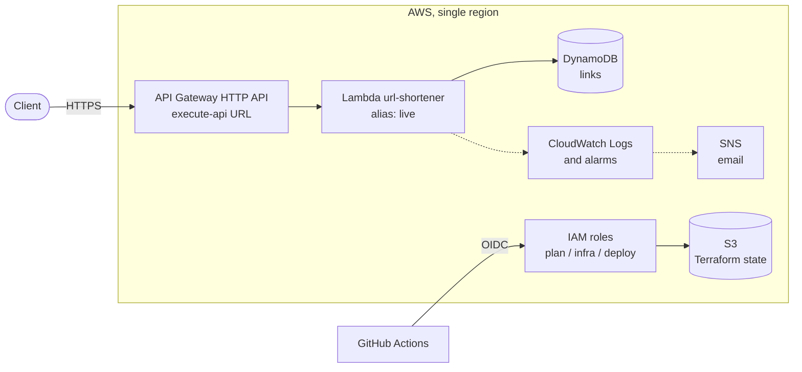
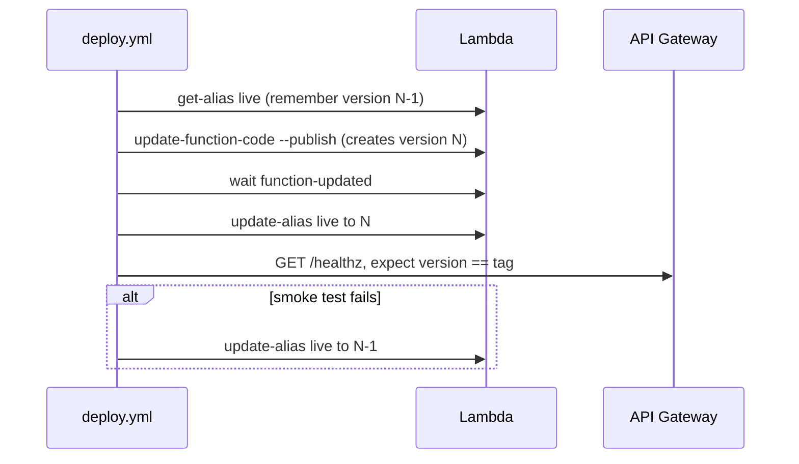

# Architecture

> **Status:** Proposed on 2026-09-13. Nothing in this document is implemented yet.
> Today the service runs locally or as a container, with an in-memory store. This
> document describes the target production setup and the CI/CD pipelines that will
> deliver it.

## Context

- **Goal.** This is a learning and portfolio project. The setup should show good
  practice — infrastructure as code, keyless CI access to the cloud, immutable
  artifacts and automated rollback — while costing close to nothing.
- **Constraints.** There is a single environment, production. Infrastructure is
  managed with Terraform. The repository is on GitHub, so
  CI/CD runs on GitHub Actions.
- **Starting point.** A stateless Go HTTP service (`cmd/api`). Storage sits behind
  the `links.Store` interface, and its only implementation so far is in-memory.
  The move to persistent storage is still pending.

## Decisions

| Area             | Decision                                    | Main alternative, and why not                                                                                                        |
| ---------------- | ------------------------------------------- | ------------------------------------------------------------------------------------------------------------------------------------ |
| Compute          | AWS Lambda (Go, `provided.al2023`, arm64)   | ECS Fargate + ALB avoids cold starts, but the ALB alone costs more than $16/month.                                                   |
| Entry point      | API Gateway HTTP API                        | A Lambda Function URL behind CloudFront is cheaper, but POSTs through it must carry a SHA-256 of the body.                           |
| Data store       | DynamoDB, on-demand capacity                | RDS or Aurora Postgres: each cold start pays for a new connection, neither is free, and Aurora takes about 15 s to resume from zero. |
| IaC              | Terraform, with state in S3                 | —                                                                                                                                    |
| CI access to AWS | GitHub OIDC with one IAM role per workflow  | Long-lived access keys stored as secrets.                                                                                            |
| Domain           | None for now: the default `execute-api` URL | A custom domain with an ACM certificate. Worth adding once the project has a domain to use.                                          |
| Region           | `us-east-1`                                 | —                                                                                                                                    |
| Environments     | Production only                             | Staging plus production.                                                                                                             |
| Release trigger  | Git tags matching `v*`                      | Deploying every merge to `main`. Worth revisiting once test coverage justifies it.                                                   |

## System overview



**API Gateway (HTTP API)**

- Served from its default `execute-api` URL, which is also `PUBLIC_BASE_URL`.
  Terraform can pass that URL to the function without creating a dependency
  cycle, because the API exists before its Lambda integration does.
- A `$default` route sends every request to the function. Unknown paths therefore
  get the service's own JSON error envelope, not API Gateway's 404.
- `POST /api/v1/links` is also declared as an explicit route. That lets it have
  stricter throttling than the redirects.
- Parameter mapping sets `X-Request-Id` from `$context.requestId`. The service
  already reuses an incoming request ID, so API Gateway access logs and
  application logs share one ID.

**Lambda**

- Runtime: `provided.al2023` on arm64, 256 MB of memory.
- Timeout of 10 s. It must stay above `APP_REQUEST_TIMEOUT` (8 s by default), so
  the service's own timeout response can still be delivered.
- Environment variables: `APP_ENV=production`, `PUBLIC_BASE_URL`, `LOG_LEVEL`, and
  the name of the DynamoDB table.
- API Gateway always invokes the `live` alias, never `$LATEST`.

**DynamoDB**

- Table `links`, with the string partition key `code`.
- On-demand capacity.
- Native TTL on `expires_at`.

## Request latency

The main risk of Lambda is latency on `GET /{code}`. It comes from three places:

| Source      | Expected (estimate)             | Notes                                                                                                                      |
| ----------- | ------------------------------- | -------------------------------------------------------------------------------------------------------------------------- |
| Cold start  | ~100–200 ms of init             | Happens on the first request after idling, or when scaling out. A static Go binary is among the fastest runtimes to start. |
| Store calls | Single-digit ms each (DynamoDB) | A redirect makes two calls: `GetItem`, then `UpdateItem` for the hit counter.                                              |
| Warm total  | Tens of ms                      | API Gateway, Lambda and DynamoDB combined.                                                                                 |

These figures are estimates. After the first deploy, measure the real numbers:

- `Init Duration` on the `REPORT` log lines gives the cold-start time.
- The API Gateway metrics `Latency` and `IntegrationLatency` give the end-to-end
  time.

If cold starts turn out to be a problem, provisioned concurrency of 1 removes
them for a few USD a month.

The choice of data store matters more than the cold start. DynamoDB speaks HTTP
and holds no connections. A Postgres store would have to open a TCP and TLS
connection on every cold start, and would need pooling (RDS Proxy) as concurrency
grows.

## Data store: DynamoDB

`links.Store` maps directly onto DynamoDB operations:

| `Store` method  | DynamoDB operation                                                                       |
| --------------- | ---------------------------------------------------------------------------------------- |
| `Create`        | `PutItem` with `attribute_not_exists(code)`; a failed condition means `ErrAlreadyExists` |
| `GetByCode`     | `GetItem`; no item means `ErrNotFound`                                                   |
| `IncrementHits` | `UpdateItem` with `ADD hits :one`, which is atomic                                       |
| `Delete`        | `DeleteItem` with `attribute_exists(code)`; a failed condition means `ErrNotFound`       |
| `Ping`          | `DescribeTable`                                                                          |

Things to keep in mind:

- **TTL format.** DynamoDB TTL requires a number attribute in epoch seconds, so
  `ExpiresAt` is stored as `expires_at` in that format.
- **Lazy deletion.** DynamoDB can take days to delete expired items, so the
  `IsExpired` check in `Service.Resolve` stays.
- **Writes on redirect.** Because of `IncrementHits`, every redirect is also a
  write. That affects both cost and latency.
- **`MemoryStore` doesn't work on Lambda.** Each execution environment keeps its
  own map, and AWS recycles environments, so links vanish at random. Until
  `DynamoStore` exists, a Lambda deployment is only good for exercising the
  pipeline.

## Application changes

1. **Lambda entry point.** Add `cmd/lambda/main.go`. It builds the same router as
   `cmd/api`, but hands it to `lambda.Start` through
   `github.com/awslabs/aws-lambda-go-api-proxy/httpadapter` instead of calling
   `runServer`. The graceful shutdown and `http.Server` timeouts don't apply on
   Lambda. The request-timeout and body-size middleware still do.
2. **Shared wiring.** Move the store → service → handler → router construction
   into one function that both entry points call. Local runs keep `MemoryStore`.
3. **`make build-lambda`.** Builds with
   `GOOS=linux GOARCH=arm64 CGO_ENABLED=0 go build -tags lambda.norpc`, writes the
   binary to `dist/bootstrap`, and zips it.
4. **Tests.** With no staging environment, CI is the only gate before production.
   Today `make check` passes without running a single test.
5. **Protect link creation.** Require a bearer token on `POST /api/v1/links`,
   stored as an SSM Parameter Store `SecureString` and read at init.
6. **`DynamoStore`.** Implement it as described above.

`cmd/api` and the `Dockerfile` stay for local development and container runs.

## Infrastructure as code

```txt
infra/
  bootstrap/   applied once, by hand, with admin credentials:
               state bucket, GitHub OIDC provider, CI roles
  main/        api.tf, lambda.tf, dynamodb.tf, observability.tf,
               variables.tf, outputs.tf
```

### Ownership

| Owner                   | Manages                                                                                                                           |
| ----------------------- | --------------------------------------------------------------------------------------------------------------------------------- |
| Terraform, `infra/main` | Every resource, IAM, the function's configuration (memory, timeout, environment variables), and the existence of the `live` alias |
| `deploy.yml`            | The function's code, its published versions, and which version `live` points to                                                   |

Enforcing that split takes the following rules:

- **Function code.** `aws_lambda_function` is created from a placeholder zip and
  sets `lifecycle { ignore_changes = [filename, source_code_hash] }`. Otherwise an
  apply could overwrite the deployed code.
- **Alias target.** `aws_lambda_alias.live` sets
  `lifecycle { ignore_changes = [function_version] }`. Without this, every apply
  rolls production back to the version Terraform last saw.
- **Configuration changes need a redeploy.** A published version freezes both code
  and configuration, so a new environment variable doesn't reach production until
  a new version is published. After an apply that changes the function's
  configuration, `infra.yml` triggers `deploy.yml` for the tag that is currently
  live.
- **Finding the live tag.** Each published version's description is its git tag,
  so the live tag is the description of the version `live` points to.
- **Never publish `$LATEST` directly.** After a rollback it still holds the bad
  code.
- **State.** The S3 backend uses `use_lockfile = true` (native locking, so no
  DynamoDB lock table) on a bucket with versioning enabled.
- **Bootstrap state.** `infra/bootstrap` keeps local state on its first apply and
  can be migrated into the bucket afterwards. State files are never committed.

## CI/CD

### Workflows

| Workflow     | Trigger                                                                   | Does                                                                                                               |
| ------------ | ------------------------------------------------------------------------- | ------------------------------------------------------------------------------------------------------------------ |
| `ci.yml`     | Pull requests and pushes to `main`                                        | `make check`, `govulncheck`, `make build-lambda`, and `docker build` without pushing                               |
| `infra.yml`  | Pull requests and pushes to `main` that touch `infra/**`                  | On PRs: `fmt -check`, `validate`, `tflint`, `trivy config`, and `plan` posted as a PR comment. On `main`: `apply`. |
| `deploy.yml` | Tags `v*`, or `workflow_dispatch` with a tag, for redeploys and rollbacks | Build, deploy, smoke test, automatic rollback, GitHub Release                                                      |

Repository settings:

- Branch protection on `main` requires `ci.yml` to pass.
- The GitHub environment `production` only allows `v*` tags.
- The GitHub environment `infra` only allows `main`.
- Jobs that talk to AWS need the permissions `id-token: write` and
  `contents: read`.
- Pull requests from forks get no OIDC token, so plans only run for branches in
  this repository.

### Deploy and rollback

`deploy.yml` runs these steps:

1. **Build.** If the tag already has a GitHub Release, as in a redeploy or a
   rollback, download its zip and verify it against `SHA256SUMS`. Nothing is
   rebuilt. Otherwise, run the tests, then `make build-lambda VERSION=<tag>`, and
   upload the zip and its checksum as a workflow artifact. Either way, the deploy
   job deploys that exact file.
2. **Deploy** (environment `production`). Record the version `live` currently
   points to. Upload the zip with `update-function-code --publish`, wait with
   `aws lambda wait function-updated`, and point `live` at the new version.
3. **Smoke test.** `GET /healthz` must return a `version` equal to the tag. Once
   `DynamoStore` exists, also create a link and check that `GET /{code}` answers
   `302`. The job reads the API token from SSM with the `gh-deploy` role, so the
   token isn't duplicated as a GitHub secret.
4. **Rollback.** If the smoke test fails, point `live` back at the recorded version
   and fail the job. This takes seconds.
5. **Release.** On the first deploy of a tag, publish a GitHub Release with the zip
   and its checksum. Redeploys and rollbacks leave the Release unchanged.



### AWS access from GitHub

No AWS credentials are stored in GitHub. Each workflow assumes its own role
through OIDC, and each role's trust policy only accepts one token `sub`:

| Role        | Allowed `sub`                                         | Permissions                                                                                                                                                      |
| ----------- | ----------------------------------------------------- | ---------------------------------------------------------------------------------------------------------------------------------------------------------------- |
| `gh-plan`   | `repo:emaforlin/url-shortener:pull_request`           | Read-only, plus the state lock object                                                                                                                            |
| `gh-infra`  | `repo:emaforlin/url-shortener:environment:infra`      | Manage the project's resources                                                                                                                                   |
| `gh-deploy` | `repo:emaforlin/url-shortener:environment:production` | `UpdateFunctionCode`, `PublishVersion`, `GetAlias`, `UpdateAlias` and `GetFunction` on the one function; `ssm:GetParameter` on the API token, for the smoke test |

## Observability

- **Logs.** The service writes JSON logs to stdout, which land in CloudWatch Logs.
  The log group is declared in Terraform with 14-day retention. A group that Lambda
  creates on its own never expires.
- **API Gateway access logs** go to CloudWatch with the same retention.
- **Alarms**, each notifying SNS by email: Lambda `Errors`, Lambda `Throttles`,
  API Gateway 5xx responses, and API Gateway p99 `Latency`.
- **Budget.** An AWS Budget alerts at 5 USD per month.

## Security

- No long-lived AWS credentials exist anywhere. See the role table above.
- The Lambda execution role can only call `GetItem`, `PutItem`, `UpdateItem`,
  `DeleteItem` and `DescribeTable` on the `links` table, read its SSM parameter,
  and write logs.
- An open URL shortener gets abused for phishing quickly. Link creation therefore
  requires a bearer token and has strict API Gateway throttling. There is no
  public demo: visitors can follow links, but only the maintainer creates them.
- The service already refuses targets that aren't `http`/`https`, and targets that
  point back at its own host.

## Cost

Estimated at 0–2 USD per month with portfolio-level traffic:

| Service     | Expected cost                                              |
| ----------- | ---------------------------------------------------------- |
| Lambda      | Covered by the always-free tier                            |
| DynamoDB    | Cents; on-demand requests are billed per million           |
| API Gateway | About 1 USD per million requests                           |
| CloudWatch  | Within the free tier, provided log retention stays bounded |
| S3 (state)  | Cents                                                      |

AWS changed its free tier for new accounts in 2025. Check what applies to the
account before relying on these figures.

## Running as a container

The `Dockerfile` builds `cmd/api` for local runs or any container platform:

- **No `HEALTHCHECK`.** The image is built on `scratch`, which has no shell to run
  one, so the orchestrator's probes must do this job instead.
- **Liveness probe:** `GET /healthz`. It never checks dependencies, so a brief
  store outage doesn't get a healthy process killed.
- **Readiness probe:** `GET /readyz`. It pings the store and returns `503` when the
  store is unreachable, which takes the instance out of the load balancer without
  restarting it.
- **Shutdown.** On `SIGTERM` the server drains in-flight requests for up to
  `APP_SHUTDOWN_TIMEOUT` (15 s by default). The termination grace period must be
  longer than that.
- **Replicas.** With `MemoryStore`, run a single replica. Each instance holds its
  own links.

Lambda uses neither probe. There, `/healthz` serves as the post-deploy smoke test.

## Implementation plan

The functional specs in [`specs/`](specs/README.md) define when each step is
done and how to verify it.

- [ ] `cmd/lambda`, the shared wiring, and `make build-lambda`
- [ ] `infra/bootstrap`, applied once by hand
- [ ] `ci.yml`, plus branch protection on `main`
- [ ] `infra/main` and `infra.yml`
- [ ] `deploy.yml`, with the smoke test on `/healthz`
- [ ] `DynamoStore`, bearer-token protection, and the full smoke test

## Open questions

- **Release trigger.** Whether to switch from tags to deploying every merge to
  `main`, once the tests are strong enough to be the only gate.
